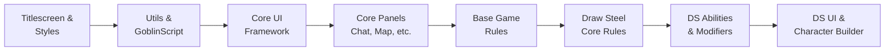

# Loading System

Understanding how the codebase loads is essential for working with it. Unlike a typical application with imports scattered across files, Draw Steel Codex has a single, centralized entry point.

## `main.lua` — The entry point

`main.lua` contains **517 `require()` calls** in a flat list. Every file in the project is loaded through this one file:

```lua
-- main.lua (excerpt — first 20 lines)
require('DMHub_Titlescreen_6089.Titlescreen')
require('DMHub_Titlescreen_6089.Styles')
require('DMHub_Titlescreen_6089.AbilityStyles')
require('DMHub_Titlescreen_6089.Settings')
require('DMHub_Titlescreen_6089.DisplayGradients')
require('DMHub_Utils_5b73.Utils')
require('DMHub_Utils_5b73.CoroutineUtils')
require('DMHub_Utils_5b73.GoblinScript')
require('DMHub_Core_UI_752e.Gui')
require('DMHub_Core_UI_752e.Hud')
-- ... 507 more requires
```

## Loading order

The order is **dependency-driven**. Files that provide base types load before files that extend them:



In practice, the loading sequence groups modules together:

1. **Titlescreen & Styles** — Display setup, visual styles
2. **Utils** — `Utils.lua`, `GoblinScript.lua`, `CoroutineUtils.lua`
3. **Core UI** — `Gui.lua`, `Hud.lua`, `DockablePanel.lua`, controls
4. **Core Panels** — Chat, Character panel, Map tools, Compendium
5. **Base Game Rules** — `Creature.lua`, `Character.lua`, `ActivatedAbility.lua` (104 files)
6. **Draw Steel Core Rules** — `MCDMRules.lua`, `MCDMCreature.lua` (65 files)
7. **Draw Steel Abilities & Modifiers** — Individual behavior implementations
8. **Draw Steel UI** — Action bar, character sheet, character builder
9. **Additional systems** — Downtime, documents, importers, dev tools

## The `require` path format

Each require uses the pattern:

```lua
require('ModuleName_XXXX.FileName')
```

Where:
- `ModuleName_XXXX` is the directory name (e.g., `DMHub_Game_Rules_fc51`)
- `FileName` is the Lua file without the `.lua` extension (e.g., `Creature`)

So `require('DMHub_Game_Rules_fc51.Creature')` loads `DMHub_Game_Rules_fc51/Creature.lua`.

## Module lifecycle

Every Lua file starts with:

```lua
local mod = dmhub.GetModLoading()
```

The `mod` object provides:

- **`mod.unloaded`** — Boolean flag. Check this in delayed callbacks to avoid operating on stale state:

    ```lua
    dmhub.Schedule(2.0, function()
        if mod.unloaded then return end
        -- safe to proceed
    end)
    ```

- **`mod:GetDocumentSnapshot(id)`** — Access shared cloud documents (see [Shared Documents](../patterns/shared-documents.md))
- **`mod:RegisterDocumentForCheckpointBackups(id)`** — Register documents for save-state backups

## Why you cannot create new files

!!! danger "Critical constraint"
    Lua files must be registered through DMHub's module system. You cannot simply create a new `.lua` file and add a `require` to `main.lua`.

The DMHub engine maintains an internal registry of files per module. When `require` is called, the engine looks up the file in this registry — not on disk. Adding a require for an unregistered file will cause a **load failure** that breaks the entire mod.

If new code is needed:

1. **Prefer adding to an existing file** in the appropriate module
2. If a new file is truly necessary, it must be created and registered through the DMHub module system (this is done inside the DMHub application, not from the filesystem)

## File count by module

For reference, here are all 42 modules sorted by file count:

| Module | Files |
|--------|-------|
| `DMHub_Game_Rules_fc51` | 104 |
| `Draw_Steel_Core_Rules_1b8f` | 65 |
| `DMHub_Core_Panels_65a9` | 49 |
| `Downtime_Projects_c618` | 27 |
| `DocumentSystem_3045` | 25 |
| `Draw_Steel_Character_Builder_45c3` | 24 |
| `Draw_Steel_Ability_Behaviors_aef5` | 23 |
| `DMHub_Game_Hud_efeb` | 22 |
| `DMHub_Core_UI_752e` | 21 |
| `Draw_Steel_UI_bd58` | 17 |
| `DMHub_Compendium_c080` | 16 |
| `Draw_Steel_V_567e` | 13 |
| `Development_Utilities_aa55` | 13 |
| `Draw_Steel_Modifiers_d18e` | 10 |
| `DMHub_CharacterSheet_5e_b1b6` | 10 |
| `DMHub_Utils_5b73` | 8 |
| `DMHub_Titlescreen_6089` | 6 |
| `THC_Forge_Steel_Character_Importer_15c0` | 6 |
| `Monster_AI_d7b4` | 5 |
| `Draw_Steel_UX_Update_cec0` | 5 |
| `DMHub_Import_Framework_6cc3` | 5 |
| `DMHub_CharacterSheet_Base_b03e` | 5 |
| `Draw_Steel_Importers_3466` | 4 |
| `DMHub_Token_UI_203c` | 4 |
| `Timeline_e083` | 3 |
| `Chat_Enhancements_6e49` | 3 |
| `ChatPanel_cb3b` | 3 |
| `Draw_Steel_Beastheart_b691` | 2 |
| `Draw_Steel_Audio_06c8` | 2 |
| `DrawSteelActionBar_5d75` | 2 |
| `Codex_Titlescreen_1eb4` | 2 |
| `Codex_Quotes_2aae` | 2 |
| `Codex_Macros_ac16` | 2 |
| `Targetable_Objects_34c9` | 1 |
| `Potency_Adjustment_Mod_b741` | 1 |
| `LanguageRelations_0df1` | 1 |
| `Image_Zoo_8f12` | 1 |
| `Great_Library_Macros_a4ba` | 1 |
| `Draw_Steel_Inventory_8a0f` | 1 |
| `Draw_Steel_Character_Build_38e3` | 1 |
| `Draw_Steel_8a33` | 1 |
| `DelianTomb_046b` | 1 |
