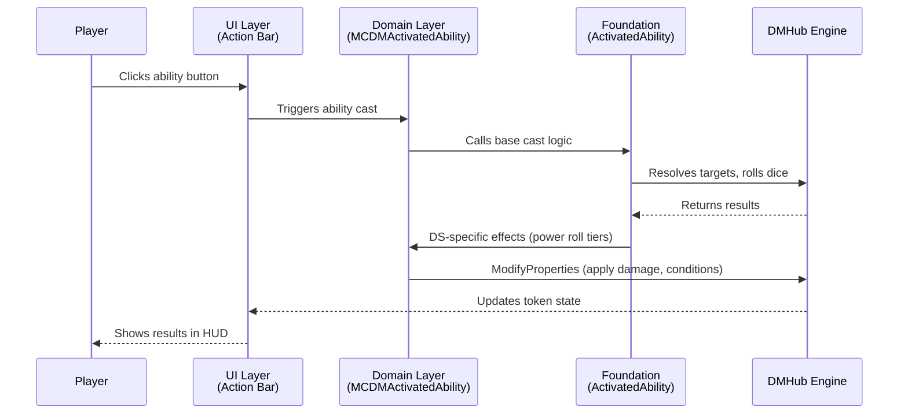

# Architecture Overview

The Draw Steel Codex is organized in four layers. Each layer builds on the one below it.

```mermaid
graph TD
    subgraph "Layer 4: UI & Integration"
        UI[Draw Steel UI<br/>Character Builder<br/>Panels & HUD]
    end

    subgraph "Layer 3: Domain (Draw Steel)"
        DS[Draw Steel Core Rules<br/>Ability Behaviors<br/>Modifiers]
    end

    subgraph "Layer 2: Foundation (DMHub)"
        FND[Game Rules<br/>Core UI Framework<br/>Utilities]
    end

    subgraph "Layer 1: Engine API"
        ENG[Definitions<br/>LuaLS Type Stubs]
    end

    UI --> DS
    DS --> FND
    FND --> ENG

    style ENG fill:#3a3a5c,stroke:#6c6c9c
    style FND fill:#2d4a2d,stroke:#5c8a5c
    style DS fill:#4a2d2d,stroke:#8a5c5c
    style UI fill:#4a3a2d,stroke:#8a7c5c
```

## Layer 1: Engine API (`Definitions/`)

These 209 files are **LuaLS type stubs** — they document the closed-source DMHub engine API but contain no real logic. They define the globals you'll see everywhere:

- `dmhub` — Game state, tokens, scheduling, file I/O, events
- `gui` — UI panel constructors and control types
- `game` — The active game session
- `creature` / `token` — Entity types
- `GameRules` — Rule system interface

You never edit these files, but they're essential for understanding what engine functions are available.

## Layer 2: Foundation

The generic, system-agnostic game framework. This is where core concepts are defined before any specific RPG system is applied.

| Module | Files | What it provides |
|--------|-------|-----------------|
| `DMHub_Game_Rules_fc51` | 104 | Creature, Character, Monster, ActivatedAbility, Condition, Equipment, Class, Modifier system |
| `DMHub_Core_UI_752e` | 21 | `Gui.lua` (panel wrapper), `Hud.lua`, `DockablePanel`, `Scrollable`, dropdowns, buttons |
| `DMHub_Utils_5b73` | 8 | `Utils.lua` (helpers), `GoblinScript.lua` (formula engine), `CoroutineUtils.lua` |

Key patterns established here:

- [Game Type registration](../patterns/game-types.md) (`RegisterGameType`)
- [Data Tables](../patterns/data-tables.md) (`dmhub.GetTable`)
- [Token Mutations](../patterns/token-mutations.md) (`ModifyProperties`)
- [Declarative UI](../patterns/ui-framework.md) (`gui.Panel{}`)

## Layer 3: Domain (Draw Steel)

The MCDM-specific implementation. This layer extends and overrides foundation types to implement Draw Steel's game mechanics.

| Module | Files | What it provides |
|--------|-------|-----------------|
| `Draw_Steel_Core_Rules_1b8f` | 65 | MCDMRules (clears base rules, sets DS names), MCDMCreature, MCDMCharacter, MCDMMonster, power rolls, resources, skills |
| `Draw_Steel_Ability_Behaviors_aef5` | 23 | Individual ability implementations: damage, forced movement, temporary effects, macros |
| `Draw_Steel_Modifiers_d18e` | 10 | Modifier implementations: captain, forced movement, invisibility, etc. |
| `Downtime_Projects_c618` | 27 | Downtime project system (rules + UI) |

The critical file is **`MCDMRules.lua`** — it calls `GameSystem.ClearRules()` and then registers Draw Steel-specific names:

- "Hit Points" becomes "Stamina"
- "Abilities" becomes "Characteristics"
- Standard rolls become "Power Rolls"

## Layer 4: UI & Integration

User-facing panels, character creation, and tools.

| Module | Files | What it provides |
|--------|-------|-----------------|
| `DMHub_Core_Panels_65a9` | 49 | Chat, Character panel, Map tools, Compendium, Audio, Dev tools |
| `Draw_Steel_UI_bd58` | 17 | DS action bar, character sheet, class/kit editors, roll dialogs |
| `Draw_Steel_Character_Builder_45c3` | 24 | Character creation wizard (state machine + selection UIs) |
| `DMHub_Game_Hud_efeb` | 22 | Action bar, initiative bar, roll dialogs, rest dialogs |
| `DMHub_Compendium_c080` | 16 | Compendium browser and content editors |
| `DocumentSystem_3045` | 25 | Rich documents: Markdown, images, embedded dice rolls, encounters |

## Data flow: a game action

Here's how a typical game action (like using an ability) flows through the layers:

## Cross-cutting concerns

Some systems span multiple layers:

- **[GoblinScript](../patterns/goblinscript.md)** — Defined in Utils, used everywhere for damage formulas, prerequisites, and display text
- **[Shared Documents](../patterns/shared-documents.md)** — Cloud-synced state used for chat, initiative, audio, and session data
- **[Data Tables](../patterns/data-tables.md)** — Named tables storing all game content (abilities, conditions, classes, monsters)

## Next steps

- [Module Map](module-map.md) — Complete listing of all 42 modules
- [Loading System](loading-system.md) — How `main.lua` boots the codebase
